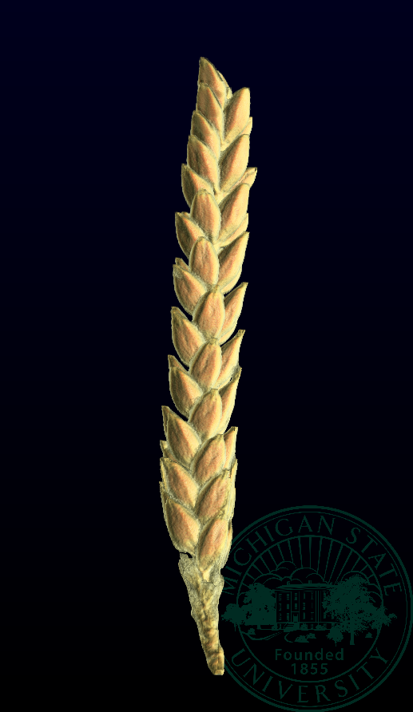

```{r setup, include=FALSE}
options(htmltools.dir.version = FALSE)
```

# Cool title

<div class="row">
  <div class="column" style="max-width:20%">
    
    
  </div>
  <div class="column" style="max-width:20%">
    
    
  </div>
  <div class="column" style="max-width:20%">
    
    
  </div>
  <div class="column" style="max-width: 40%; padding: 0 0 0 25px;">
    <p> This whole slide is extremely hacky. Not worse than using \includegraphics in LaTeX, but not better either. The infinite_moon reader does help a little bit.  </p>
    <p> Essentially,  a kind of crude tab environment is defined in the CSS</p>
    <p> Then rest is to write straight HTML markup. </p>
    <ul>
      <li> The markdown convenience is lost. </li>
      <li> Minimize this kind of slides: text next to images. </li>
    <ul>
  </div>
</div>


---
