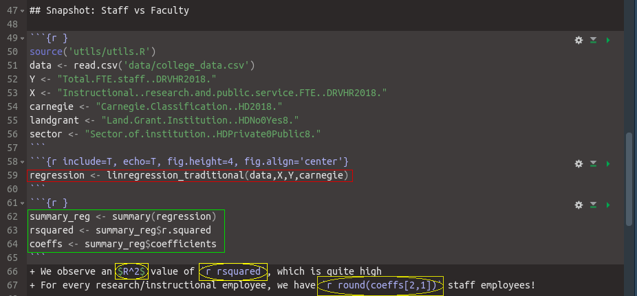
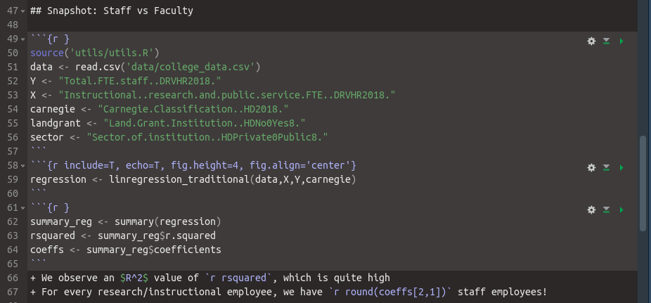

```{r setup, include=F}
library(rmarkdown)
knitr::opts_chunk$set(echo = FALSE)
knitr::opts_chunk$set(include = FALSE)
knitr::opts_chunk$set(engine.path = list(python = '/usr/bin/python3'))
```

## Overview

1. Example
    1. From raw text to gorgeous HTML
    1. General idea behind RMarkdown
1. 3 Component chunks
    1. Metadata
    1. Text (Markdown)
    1. Code chunks
1. Additional perks
    1. pandoc
    1. BiBTeX and reference management
    1. CSS customization
    1. To the infinity and beyond

+ This whole presentation (ioslides) was made **in RMarkdown**.

## Plain text input

```{r include=T, fig.cap="RMarkdown sample", out.width = '100%'}

```

## Snapshot: Staff vs Faculty

```{r data_read}
source('utils/utils.R')
data <- read.csv('data/college_data.csv')
Y <- "Total.FTE.staff..DRVHR2018."
X <- "Instructional..research.and.public.service.FTE..DRVHR2018."  
carnegie <- "Carnegie.Classification..HD2018."
landgrant <- "Land.Grant.Institution..HDNo0Yes8."
sector <- "Sector.of.institution..HDPrivate0Public8."
```
```{r linear_regression, include=T, echo=T, fig.height=4, fig.align='center'}
regression <- linregression_traditional(data,X,Y,carnegie)
```
```{r results}
summary_reg <- summary(regression)
rsquared <- summary_reg$r.squared
coeffs <- summary_reg$coefficients
```
+ We observe an $R^2$ value of `r rsquared`, which is quite high
+ For every research/instructional employee, we have `r round(coeffs[2,1])` staff employees!

## One ring to rule them all

```{r include=T, out.height="30%",fig.cap="Work flow",fig.show='hold',fig.align='center'}
knitr::include_graphics('figs/rmarkdownflow.png')
```

+ RMarkdown is WYSIWYM as opposed to WYSIWYG
    + What you see is what you mean _vs_ get.
+ A single plain text document to produce
    + High quality reports: PDF, HTML, Word
    + High quality presentations: Slidy, ioslides, beamer, PowerPoint
    + To the infinity and beyond: flexboards, documentation,books, thesis, etc.
    
+ Integrate multiple languages: R, python, bash, julia, etc.
+ The basics come bundled with 

```{r eval=F, echo=T, include=T}
install.packages('rmarkdown')
```
+ This whole presentation is based on Xie Yihui's [extensive documentation on RMarkdown and its spin-offs](https://bookdown.org/yihui/rmarkdown/installation.html) [@Xie2018]

# 3 Components: metadata, text, code chunks

## Metadata = YAML

+ Metadata indicated at the top sets the general behavior of the document
+ As in pandoc, use YAML (established format)
+ Tabs matter
```
---
title: Walking through RMarkdown
author: Erik Amézquita
date: May 18th, 2020
output: 
  ioslides_presentation:
    smaller: True
    logo: "figs/cmse_logo_transparent.png"
---
```
+ Check the [cheatsheet](https://rstudio.com/wp-content/uploads/2015/03/rmarkdown-reference.pdf) for all the possible options.

## Text = pandoc's markdown

1. WYSIWYM (What you see is what you mean.)
1. **Markdown is** a _markup language_: f^o^rma~t~ text ~~with some~~ `quick rules`.
    1. Look at the [previous reference](https://rstudio.com/wp-content/uploads/2015/03/rmarkdown-reference.pdf) or at [pandoc's documentation](https://pandoc.org/MANUAL.html#pandocs-markdown). 
    1. No more need to click here and there
        + No need to use shortcuts
+ Ideal to take notes in class
+ Or to write quick lists in any text processor: notepad, gedit, RStudio, vim

```
## Text = pandoc's markdown

1. WYSIWYM (What you see is what you mean.)
1. **Markdown is** a _markup language_: f^o^rma~t~ text ~~with some~~ `quick rules`.
    1. Look at the [previous reference](https://rstudio.com/wp-content/uploads/2015/03/rmarkdown-reference.pdf) or at [pandoc's documentation](https://pandoc.org/MANUAL.html#pandocs-markdown). 
    1. No more need to click here and there
        + No need to use shortcuts
+ Ideal to take notes in class
+ Or to write quick lists in any text processor: notepad, gedit, RStudio, vim
```

## Text: Typeset math symbols with $\LaTeX$

+ Mathematical typeseting $\displaystyle \int_\alpha^\infty \frac{dt}{t\log t} = \log(\log t)\bigg|_\alpha^\infty = \infty$ is supported by $\LaTeX$. 
+ Put the $\LaTeX$ code in between `$` symbols as usual
```
$\displaystyle \int_{\alpha}^{\infty} \frac{dt}{t\log t} 
= \log(\log t)\bigg|_{\alpha}^{\infty} = \infty$
```
+ Superscripts with `^`: $2^{10}=1024$ is `$2^{10}=1024$`
+ Subscripts with `_`: $t_{10}$ is `$t_{10}$`
+ A quick list of common symbols can be found at the end of [this document](https://www.ntg.nl/doc/biemesderfer/ltxcrib.pdf)
+ As a personal note, $\LaTeX$ typesets the most beautiful documents you'll find out there. It is worth to look into more detail. This is [one](https://en.wikibooks.org/wiki/LaTeX/Introduction) of the many resources out there.

## Text: Images `knitr::include_graphics()`

```{r include=T, echo=T, out.width=150, fig.cap="caption", fig.show='hold', fig.align='center'}

knitr::include_graphics(c('figs/S017_L3_26.png', 'figs/S017_L4_01.png', 'figs/seed2_X.gif'))
```

+ More flexibility. Take advantage of the full power behind RMarkdown.

## Code chunks

+ Pieces of a usual coding script
+ Wrangle data, crunch numbers, plot results, showcase tables, etc
+ These are delimited with ````` with a few specifications
    + Specify the programing language
    + Label (optional)
    + Diverse options: show code? Show result? Center the plot? Size of the graph?

```
     {r label, options}
     some R code
```

+ In RStudio, use the `Ctrl + Alt + I` shortcut to make a new code chunk (`Cmd + Option + I` on macOS).
+ Check the [cheatsheet](https://rstudio.com/wp-content/uploads/2015/03/rmarkdown-reference.pdf) for all the possible code chunk options.

## Once again

+ Some default options can be defined globally at the beginning via `opts_chunk$set()`

```{r include=T, echo=T, eval=F}
# do not show code unless stated otherwise
knitr::opts_chunk$set(echo = FALSE) 
# do not include the chunk in the final version
knitr::opts_chunk$set(include = FALSE) 
# point RMarkdown to the right python engine
knitr::opts_chunk$set(engine.path = list(python = '/usr/bin/python3'))
```

```{r include=T, out.width = '85%', fig.align='center'}

```

## Gamebreaker: Execute more than just R

+ Solve an ODE with `python3` via `scipy.integrate.odeint` 

```{python echo=T, include=T, eval=T}
import matplotlib.pyplot as plt
import numpy as np
from scipy.integrate import odeint

def f(y, t, k=0.2):
  r=(1+2*np.sin(t)-np.cos(t))/5
  return r*y-k

t  = np.linspace(0, 20., 1000)

for i in range(6):
    y0=0.1*i+0.5
    soln = odeint(f, y0, t)
    plt.plot(t,soln, label="y0="+str(y0))

plt.xlabel("time")
plt.ylabel("population")
plt.title("Population Dynamics")
plt.legend()
plt.grid()

```

## Sure enough, we get python plots

+ ODE $\frac{dy}{dt} = r(t)y-k, \quad y(0)=y_0$
+ Growth rate $r(t) = \frac{1}{5}(1+2\sin t - \cos t)$
+ Constant predation rate $k=\frac{1}{5}$
+ Explore which initial population value $y_0$ is critical to avoid extintion.

```{python echo=T, include=T, out.width=450, out.height=300, fig.align='center'}
plt.show()
```

## Bash is also supported

```{bash echo=T, include=T}
echo "The following RMarkdowns were found here"
for file in *.Rmd
do
  echo $file" --->  ""${file%.*}"".html"
done
```

+ caveat: unlike r, we won't be able to save results from bash for other chunks!
+ however, python carries its variables from chunk to chunk like r
+ nonetheless, python and r live in separate environments
+ check [here](https://bookdown.org/yihui/rmarkdown/language-engines.html) for more details on how exchange information between r and python via the `reticulate` library in r.

# Additional perks

## pandoc

```{r echo=T, include=T, eval=F}
rmarkdown::pandoc_convert('day2_summary.md', output='day2_summary.pdf')
```
```{r include=T,  out.width=350, fig.cap="Taking easy notes", fig.show='hold', fig.align='center'}
knitr::include_graphics(c('figs/summary_md2.png', 'figs/summary_pdf2.png'))
```

+ From markdown, TeX, word, odt, rtf, html, ipynb, ebook, etc.
+ To PDF, beamer, markdown, TeX, word, odt, rtf, html, etc.
+ Go to the [official pandoc documentation](https://pandoc.org/MANUAL.html) for more details.

## Reference management with [BiBTeX](https://rmarkdown.rstudio.com/authoring_bibliographies_and_citations.html) {.build}

+ Insert and manage references and citations with a `.bib` text file.
```
@Book{Xie2018,
    title = {R Markdown: The Definitive Guide},
    author = {Yihui Xie and J.J. Allaire and Garrett Grolemund},
    publisher = {Chapman and Hall/CRC},
    address = {Boca Raton, Florida},
    year = {2018},
    note = {ISBN 9781138359338},
    url = {https://bookdown.org/yihui/rmarkdown},
}
```
+ Specify in the path to the `.bib` file in the YAML preamble with `bibliography`.
+ With `@Xie2018` we cite @Xie2018.
+ Or `[@Xie2018]` produces [@Xie2018]
+ Adding a `-` sign before `@` will omit the author: `[-@Xie2018]` generates [-@Xie2018]
+ [JabRef](http://www.jabref.org/) is an open-source GUI to manage BiBTeX bibliographies.
+ Add a `.csl` [style file](http://zotero.org/styles) in YAML preamble to change citation/reference styles.

## R comes with BiBTeX in mind

+ Use `citation("package-name")` to cite any R package with BiBTeX
```{r bibtex, include=T, echo=T}
citation('base')
```

## CSS Customization {.build}

+ Any HTML-based document (HTML, ioslides, slidy) can be further customized with a `.css` text file
```
h1,h2,h3,h4 {
  color: FireBrick;
  text-align: left;
  border-left: 6px ridge red;
  padding-left: 20px;
  font-family: Palatino;
  font-size: 1.2em;
}
```
+ In the YAML preamble mention `css: my.css` as an option
+ Customize font, size, color, background, shadow, interline space, etc.
+ Learn the basics of CSS [here](https://www.w3schools.com/Css/default.asp).
+ I **could not** find a repository of pre-made CSSs for RMarkdown.

## A whole zoo is built upon RMarkdown {.build}

+ Dashboards with **flexdashboard**
+ **Shiny** integration for interactive plots and tables
+ Webpages are dealt with **blogdown**
+ Common journal formats are available now with **rticles**
+ **bookdown** takes care of a whole book design 
+ Captivating presentations with [**xaringan**](https://slides.yihui.org/xaringan/#1)

## References
