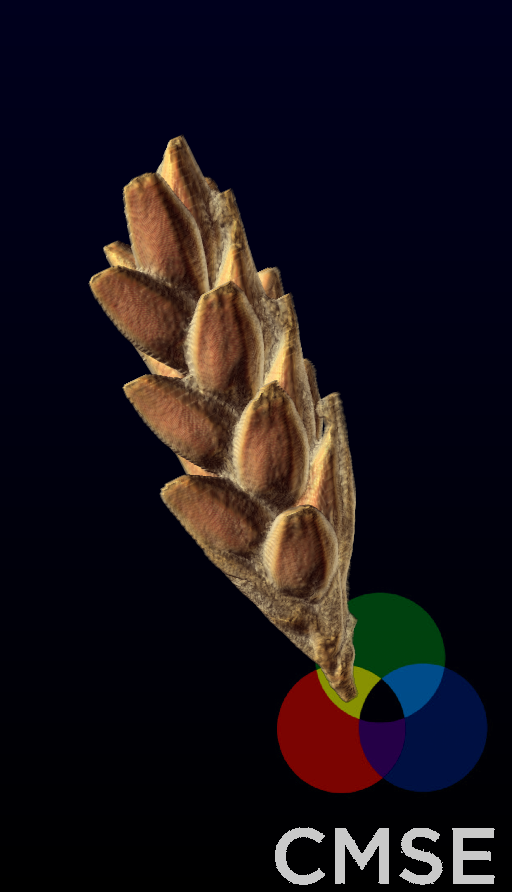

```{r setup, include=FALSE}
library(reticulate)
library(knitr)

# <!-- Copies an HTML dependency to a subdirectory of the given directory. The subdirectory name willbename-version(for example, "outputDir/jquery-1.11.0"). You may setoptions(htmltools.dir.version= FALSE)to suppress the version number in the subdirectory name. -->
options(htmltools.dir.version = FALSE)

knitr::opts_chunk$set(echo = FALSE)
knitr::opts_chunk$set(engine.path = list(
  python = '/usr/bin/python3',
  ruby = '/usr/bin/ruby'
))
```

class: center, middle

# Xaringan

RMarkdown + [remark.js](https://remarkjs.com) = Beautiful presentations

---
class: inverse

background-image: url(https://camo.githubusercontent.com/ddf949ff33a75355c0dc6bddc0e767c01cfc7dbd/68747470733a2f2f63646e2e6a7364656c6976722e6e65742f67682f656d6974616e616b612f6e696e6a612d7468656d65406d61737465722f646f63732f696d616765732f6b756e6f696368692d73686f77636173652e676966)
background-size: 850px 470px

### Produce highly customizable slides

.footnote[
Above is the `kunochi` style by [Emi Tanaka](https://emitanaka.org/). Click [here](https://emitanaka.org/ninja-theme/themes/kunoichi/kunoichi-theme-example.html) for the actual slides.
]

???

Image credit: [Contributed themes](https://github.com/yihui/xaringan/wiki/Themes)

---

# Hello World

Install the **xaringan** package as usual:

```{r include=T, echo=T, eval=FALSE}
install.packages("xaringan")
```

--

- If using RStudio, find a generous sample presentation following `File -> New File -> R Markdown -> From Template -> Ninja Presentation`

--

- `Knit` the generated `.Rmd` file as usual

--

- Or use the [RStudio Addin](https://rstudio.github.io/rstudioaddins/) "Infinite Moon Reader" to live preview the slides
    - Every time you update and save the Rmd document, the slides will be automatically reloaded in RStudio Viewer.
    - Also works for all HTML-based RMarkdown presentations (I think.)

--

- More details on `xaringan` usage [here](https://bookdown.org/yihui/rmarkdown/xaringan.html)

---

# remark.js

Create a new slide
- Use `---` to delimit slides
- Use `--` in between for incremental slides
- Add presenter notes with `???`

--

.left[left alignment with `.left[]`]
.center[centered with `.center[]`]
.right[right flush with `.right[]`]

--

- Presenter mode is supported by pressing `p`

--

- Press `h` or `?` to see more shortcuts

--
- Go through the [remark.js Wiki](https://github.com/gnab/remark/wiki) for more details

.footnote[footnotes with `.footnote[]`]

---
class: inverse, middle, center

<blockquote class="imgur-embed-pub" lang="en" data-id="3DM4P7Y" data-context="false"><a href="https://imgur.com/3DM4P7Y">The Owl and the Woodpecker, Intimidation is an Art</a></blockquote><script async src="https://s.imgur.com/min/embed.js" charset="utf-8"></script>

---

class: inverse, middle, center

# Using xaringan

<iframe width="560" height="315" src="https://www.youtube-nocookie.com/embed/4F4qzPbcFiA?controls=0" frameborder="0" allow="accelerometer; autoplay; encrypted-media; gyroscope; picture-in-picture" allowfullscreen></iframe>

---

# ioslides vs xaringan

--

.pull-left[

**Ioslides**

- pandoc power: 
    - interchangeable format: ready to make a slidy, PDF or word
    - Reference management is supported
- Works out of the box with rmarkdown (ostensibly)
- Presentation is self-contained: easier to host
- Lack of CSS repositories
- Not as customizable
]

--

.pull-right[

**xaringan**

- Much more customizable
- Available collection of ready-made CSSs
- Can highlight code
- Needs an extra bit of initial configuration
- Presentation is **not** self-contained, which could be troublesome
- pandoc power is lost
- python functionality is finnicky
- Printing PDF slides might be troublesome (see [decktape](https://github.com/astefanutti/decktape))
]

--

Both approaches keep the simplicity of markdown formating, the capacity to embbed R (and other languages), and $\LaTeX$ support.

---

class: inverse, center, middle

# Back to our previous ioslides presentation

---

background-image: url(https://upload.wikimedia.org/wikipedia/commons/thumb/1/1b/R_logo.svg/1200px-R_logo.svg.png)
background-size: 100px 80px
background-position: 95% 5%

## Snapshot: Staff vs Faculty

```{r include=F}
source('utils/utils.R')
data <- read.csv('data/college_data.csv')
Y <- "Total.FTE.staff..DRVHR2018."
X <- "Instructional..research.and.public.service.FTE..DRVHR2018."  
carnegie <- "Carnegie.Classification..HD2018."
landgrant <- "Land.Grant.Institution..HDNo0Yes8."
sector <- "Sector.of.institution..HDPrivate0Public8."
```
```{r include=T, echo=T, fig.height=4, fig.align='center'}
regression <- linregression_traditional(data,X,Y,carnegie)
```
```{r include=T, echo=T}
summary_reg <- summary(regression)
{{rsquared <- summary_reg$r.squared}}
{{coeffs <- summary_reg$coefficients}}
```
+ We observe an $R^2$ value of `r rsquared`, which is quite high
+ For every research/instructional employee, we have `r round(coeffs[2,1])` staff employees!

---

background-image: url(https://insidehpc.com/wp-content/uploads/2016/01/Python-logo-notext.svg_.png)
background-size: 100px
background-position: 95% 5%

## Gamebreaker: Execute more than just R

+ Solve an ODE with `python3` via `scipy.integrate.odeint` 

```{python echo=T, include=T, eval=F}
import matplotlib.pyplot as plt
import numpy as np
from scipy.integrate import odeint

def f(y, t, k=0.2):
  r=(1+2*np.sin(t)-np.cos(t))/5
  return r*y-k

t  = np.linspace(0, 20., 1000)

for i in range(6):
    y0=0.1*i+0.5
    soln = odeint(f, y0, t)
    plt.plot(t,soln, label="y0="+str(y0))

plt.xlabel("time")
plt.ylabel("population")
plt.title("Population Dynamics")
plt.legend()
plt.grid()
```
---

## Sure enough, we get python plots

+ ODE $\frac{dy}{dt} = r(t)y-k, \quad y(0)=y_0$
+ Growth rate $r(t) = \frac{1}{5}(1+2\sin t - \cos t)$
+ Constant predation rate $k=\frac{1}{5}$
+ Explore which initial population value $y_0$ is critical to avoid extintion.

```{python echo=F, include=T, out.width=500, out.height=350, fig.align='center'}
import matplotlib.pyplot as plt
import numpy as np
from scipy.integrate import odeint

def f(y, t, k=0.2):
  r=(1+2*np.sin(t)-np.cos(t))/5
  return r*y-k

t  = np.linspace(0, 20., 1000)

for i in range(6):
    y0=0.1*i+0.5
    soln = odeint(f, y0, t)
    plt.plot(t,soln, label="y0="+str(y0))

plt.xlabel("time")
plt.ylabel("population")
plt.title("Population Dynamics")
plt.legend()
plt.grid()
plt.show()
```
---

# HTML widgets

+ Variety of interactive plots [here](https://www.htmlwidgets.org/)

```{r echo=TRUE}
library(rgl)
mfrow3d(nr = 1, nc = 2, sharedMouse = TRUE)  
plot3d(mtcars[, 1:3], type = "s",)  
plot3d(mtcars[, 4:6], type = "s")
rglwidget()
```

---

# Images: the hacky bit

.pull-left[


]
.pull-right[
+ Place one image side by side with text.
+ Cannot resize the figure.
+ Things get hackier to have multiple images and text.
]

---
# Since we're going full HTML...

<div class="row">
  <div class="column" style="max-width:20%">
    
    
  </div>
  <div class="column" style="max-width:20%">
    
    
  </div>
  <div class="column" style="max-width:20%">
    
    
  </div>
  <div class="column" style="max-width: 40%; padding: 0 0 0 25px;">
    <p> A kind of crude tab environment is defined in the CSS</p>
    <p> Then rest is to write straight HTML markup. </p>
    <p> The infinite_moon reader does help a little bit.  </p>
    <ul>
      <li> The markdown convenience is lost. </li>
      <li> Minimize this kind of slides: text next to images. </li>
    <ul>
  </div>
</div>


